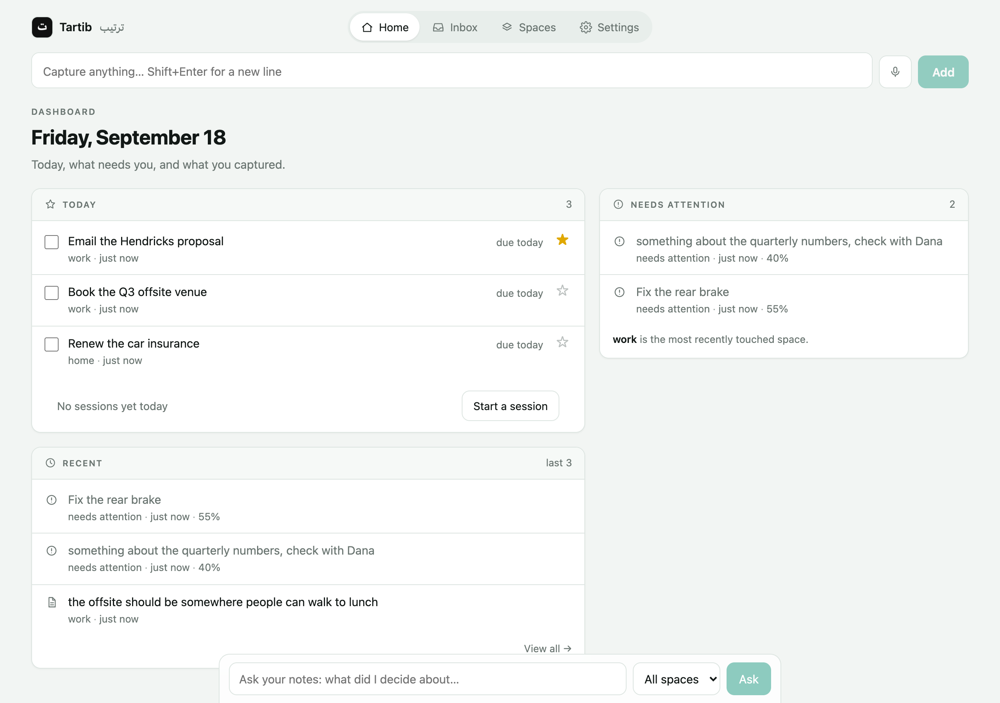
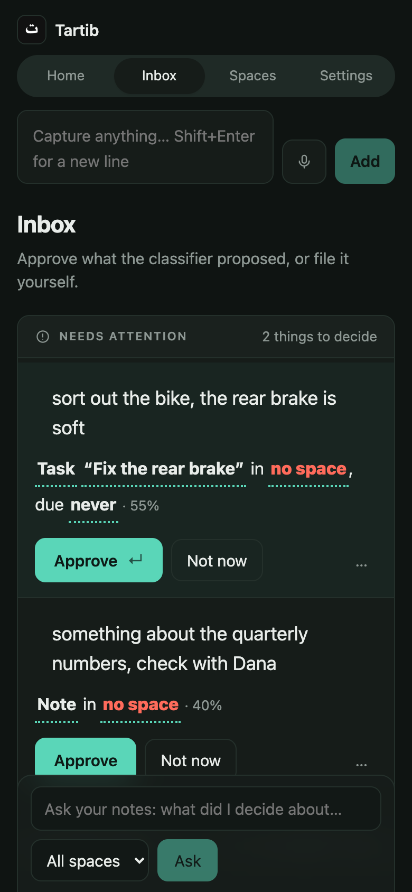
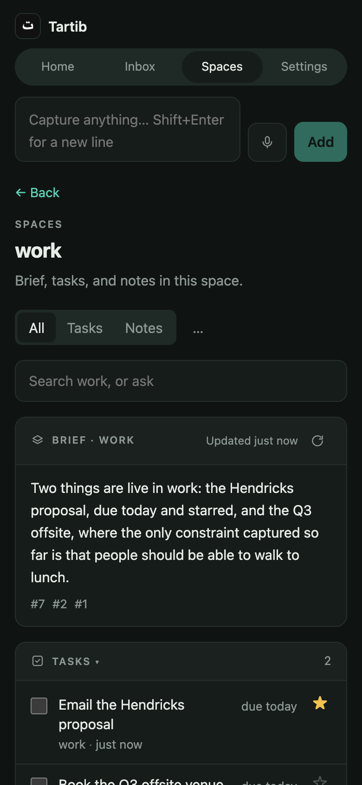
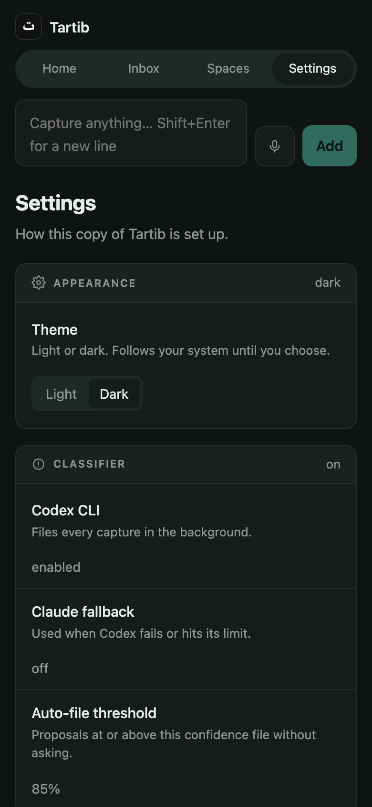

# Tartib (ترتیب)

A personal capture system. You type anything into one box. It is stored once, verbatim, as a capture. A background AI call turns it into one or more items and files them into your own spaces. Confident proposals are filed automatically; the rest wait for you in **Needs Attention**. A capture that is a question is answered from your notes instead of filed.

Your text is never rewritten. Classification only proposes fields around it.

Single user, one password, one container, MIT licensed. Tartib is deliberately small.



Four screens:

- **Home** — what is due today, overdue, starred, reminded, or worked on in a session today; what needs a decision; what you captured last.
- **Inbox** — the classifier's proposals, to approve or reject, plus tasks that have gone stale.
- **Spaces** — where things live. A brief per space, search across everything, or end with `?` to ask.
- **Settings** — how this copy is set up: theme, classifier, reminders, spaces.

<p>
  
  
  
</p>

## Run it

Needs Docker and a [Codex CLI](https://github.com/openai/codex) login on the host. Fits in 512MB; it uses about 42MiB at rest.

```sh
codex login                 # once, on the host; compose mounts ~/.codex into the container
cp .env.example .env        # set TARTIB_PASSWORD at least
docker compose up -d
open http://localhost:8000
```

No Codex? Set `TARTIB_AI_COMMAND=off` and every capture goes to Needs Attention for you to file by hand. With `TARTIB_AI_FALLBACK_COMMAND=claude`, any Codex failure is retried once through the Claude Code CLI with the same prompt and schema; both CLIs are in the image.

Spaces are managed on the Spaces screen and live in the database. `TARTIB_SPACES` only seeds the table once, when it is empty.

**Running it for real** — on a server, behind HTTPS, with push working — is in **[docs/deploying.md](docs/deploying.md)**: how to generate the password, the cookie key, the push keys and the two AI logins, the full environment table, and what to set in CapRover. Read the [security section](docs/deploying.md#security) before exposing it to anything.

## How filing works

1. `POST /api/capture` stores the text once as a capture and returns `{id}` immediately.
2. A background task runs `codex exec` (ephemeral, read-only sandbox, JSON output schema) with the text, the current time in your zone, and your configured spaces.
3. Codex returns a list of proposals, one per independent item in the text: `{text, shape, space, title, due, remind_at, confidence}`. "A, B, and C" becomes three items, each with its own verbatim excerpt.
4. Per proposal: `question` is not stored, the runner answers it from your items and keeps the answer on the capture. A space outside your list becomes null. Null space or confidence below the threshold: Needs Attention. Otherwise filed.
5. CLI missing, failing, or timing out: one plain note in Needs Attention with the error. Restart mid-classify loses nothing; pending captures are re-queued on startup.

`GET /api/captures/{id}` returns the capture, its items, and the answer if it was a question. The PWA polls it after every capture.

**Reject** discards the proposal and keeps the item in Needs Attention with no space, for you to file through Edit. **Approve** needs a space. Nothing is ever deleted by a decision; the capture keeps the original text either way.

## How ask works

`POST /api/ask` runs FTS5 over the question's content words (OR, prefix on longer words) and takes the top 20 matches, or the 20 most recent items in the chosen space when nothing matches. Those items go to Codex with a prompt that allows answering only from them and asks for the ids it relied on. The reply is `{answer, item_ids, items}`. It never writes anything. Expect about 7 to 10 seconds per question.

A space's **brief** is the same machinery with a fixed question. It is cached until an item is added or removed, or a session in that space finishes.

## Capture from anywhere

Every `/api` route accepts the password as a bearer token, so shortcuts and scripts need no login flow.

```sh
curl -X POST https://tartib.example/api/capture \
  -H "Authorization: Bearer $TARTIB_PASSWORD" \
  -H "Content-Type: application/json" \
  -d '{"text": "call the dentist tomorrow"}'
```

On iOS, an Apple Shortcut with "Get Contents of URL" (POST, JSON body, that header) plus a Share Sheet trigger gives you capture from any app.

## Install it, and capture with no signal

It is a PWA: add it to your home screen and it opens as an app, offline included. The shell is precached at install, so the first launch without a network still opens.

A capture is written to a local queue before it is sent, so the box clears at once and nothing depends on the network. One that cannot go out shows as **waiting to send** and goes when the network or the app comes back, oldest first. Each carries a `client_id`, and `POST /api/capture` answers `200` with the capture it already has if it has seen that id, so a retry is never a second capture.

Reading still needs the network. Tartib shows you nothing offline beyond what you have just typed.

A new version is offered as a line with a Reload rather than swapped in underneath you. Settings shows which service worker is actually installed, which is the only way to tell what a phone is running.

## Reminders and sessions

Web Push, for three things and nothing else: a reminder you set on a task, one daily digest at `TARTIB_SUMMARY_TIME`, and a pomodoro session ending. Turn it on in Settings; permission is only ever asked from that button. Push needs HTTPS, so it will not work from a phone over `http://`.

A session is 25 minutes by default, started on a task or on nothing, and asks **Done · Not finished · Abandoned** when it ends. Today counts them. There is no history screen, no streak, and no chart, on purpose.

Reminders need the container running. A laptop with the lid shut sends nothing.

## API

Twenty-nine routes across twenty-three paths, all under `/api`. The full list with request shapes is in **[docs/api.md](docs/api.md)**.

Every route except login, logout and health takes either the session cookie or the password as a bearer token. `due` is `YYYY-MM-DD`; `remind_at` and `created_at` are ISO 8601 in UTC. Nothing is deleted by a decision, and `POST /api/ask` never writes.

## Develop

```sh
# backend
cd backend
uv sync
TARTIB_PASSWORD=dev TARTIB_DB_PATH=./dev.db uv run uvicorn --factory tartib.main:create_app --reload
uv run pytest              # fast, offline, fake Codex
uv run pytest -m eval      # 16 real captures through the real Codex CLI, about 3 minutes
uv run ruff check .

# frontend (proxies /api to :8000)
cd frontend
npm install
npm run dev
npm run typecheck && npm run build
```

Backend is FastAPI on stdlib `sqlite3` with FTS5 and numbered SQL migrations, no ORM. Tests drive a fake Codex script as a real subprocess, so `codex` itself is never needed for the default suite. Frontend is React + Vite + TypeScript with no UI library. One container serves both.

## How this was built

`kis/` is the project's memory, and it is checked in on purpose: `knowledge/` is what is true, `intent/` is what was planned and why, `state/` is where things stand. `kis/knowledge/rules.md` holds the hard constraints, and every exception to them was argued for in writing before it was allowed. Step-by-step proof for each slice lives in the commit messages.

If you want to know why something is the way it is, that is where the answer is.

## Not planned

Projects, tags, multi-user, offline reading, a chat history for ask. Push and pomodoro were out of scope until they were argued in, under carve-outs recorded in `kis/knowledge/rules.md`; the bar for a fourth is higher than the third. The Claude CLI is a fallback for the same prompts, not a second classifier with its own behaviour.

## License

MIT. See [LICENSE](LICENSE), and [CONTRIBUTING.md](CONTRIBUTING.md) before opening a pull request.
